# Comment Choisir le Modèle Approrié à Un Problème de AI

Le Machine Learning, aussi appelé apprentissage automatique en français, est une forme d’intelligence artificielle permettant aux ordinateurs d’apprendre sans avoir été programmés explicitement à cet effet.

En Machine Learning, il existe une tonne de modèles: La régression logistique, les arbres de décision,
les support vector machine, les k-nerest neighbors, les random forests, les réseaux de neurones, ....

Bref il est difficile faire son choix parmi toutes ces possibilités, dans ce document nous allons explorer quelques possibibilité de critère de choix de modèle pour selectionner le bon modèle pour son projet en machine learning.

## Conseil #1

Ne travailler qu'avec les modèles que l'on comprend vraiment. Car nous permet d'optimiser et regler ses hyper paramètres et ensuite cela nous permet également d'éviter d'utiliser un modèle dans un context qu'il n'est pas adapté pour ne pas avoir des comportements anormaux sans qu'on ne les comprennent.

Il vaut mieux du bon travail sur un modèle basique que du mauvais travail sur des modèles sofistiqués.

## Conseil #2

Par les modèles que vous comprenez, commencez toujours par implementer le plus simple possible. Car la plupart des modèles sofistiqués consomment beaucoup de ressources et prennent beacoups de temps pour exécuter et complexes à regler.

## Exemple

Par exemple si vous travailliez sur un modèle de régression commencez toujour par:
* LinearRession
* Lasso
* Ridge
  
Si vous travailliez sur problème de classification commencez par:
* LogisticRegression
* LinearSVC
* KNeighborsClassifier
  
Car ce sont des modèles simples, facile à entrainer et facile regler également.

## Critère de choix du modèle d'un Data Scientiste
Quelles sont les critères qui permettent à un Data Scientiste de choisir un modèle plutôt qu'un autre.
Par exemple choisir un arbre decision plutôt qu'une régression Logistique.

## Critère #1: Quantité de données

Le premier critère de choix d'un modèle est la quantité de donée avec laquelle nous travaillons.

### Modèle adaptés aux gros Datasets

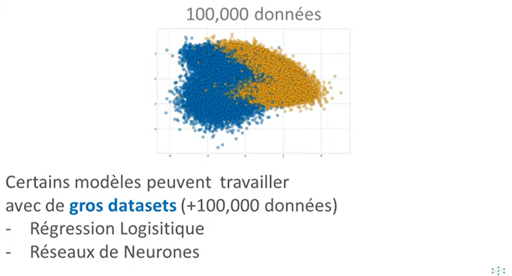

### Modèle adaptés aux petits Datasets

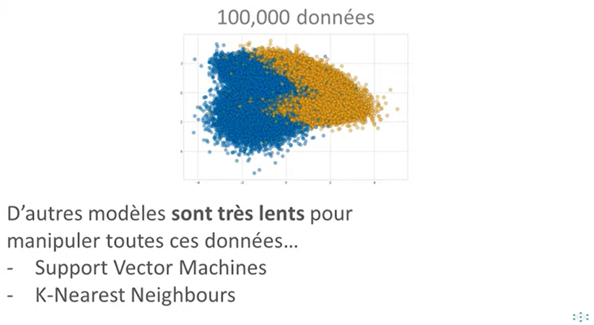

Qu'est ce qui explique cela, le fonctionnent des algorithmes (d'où le premier conseil #1: ne travaillez qu'avec des algorithme qu'on comprend).

### Par exemple KNeighborsClassifier
lorsqu'on comprend le fonctionnement d'un **KNeighborsClassifier** alors on sait pertinemment qu'on ne pas lui fournir un million de données car il stocke toutes les données en memoire pour ensuite calculer la distance entre chaque point de notre dataset.

Donc si on a un million de points dans notre dataset ce modèle va pèser très sur memoire amis aussi il va être très lent car il va calculer la distance entre chaque de notre dataset.

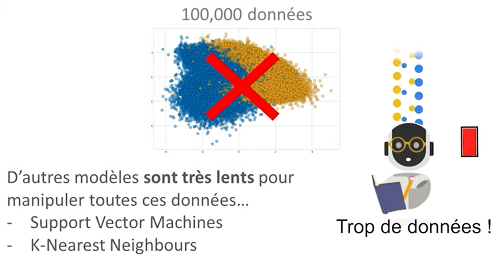
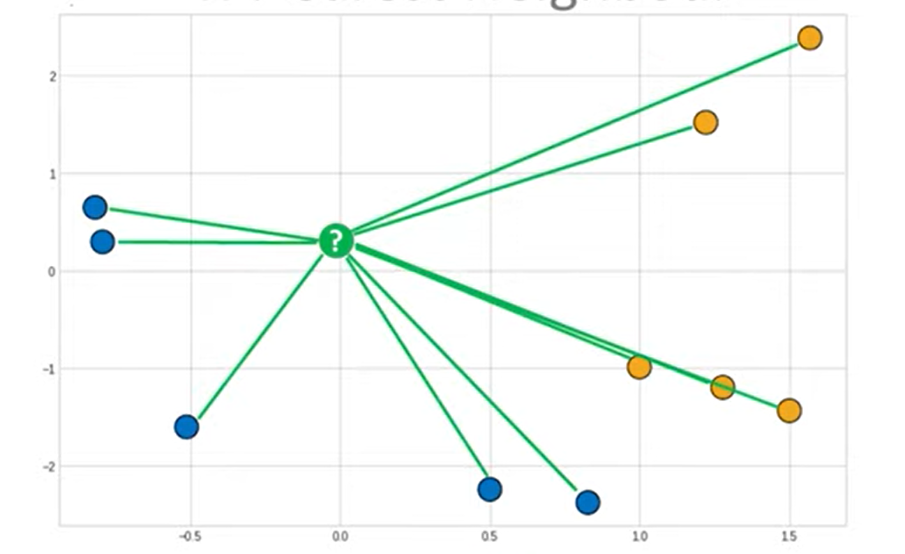

## Régression Logistique
A l'inversion si on utilise une régression logistique qui repose sur un algorithme de descente de gradient, nous pouvons progressivement fournir nos données à la descente de gradient  par petit batch ce qui permettra d'entrainer notre machine beaucoup plus rapidement pour ensuite obtenir un modèle de régression de régression logistique qui est une simple fonction lineaire donc c'est quelque de beaucoup plus leger que de stocker un million de point dans la memoire d'un **KNeighborsClassifier** .
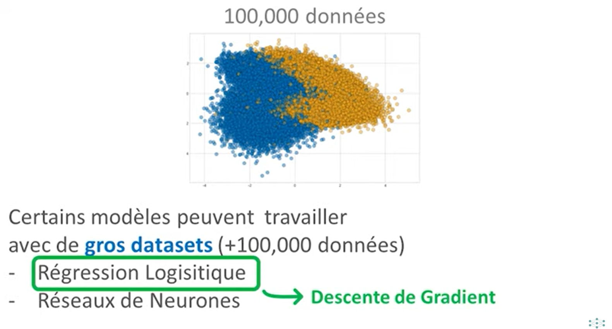
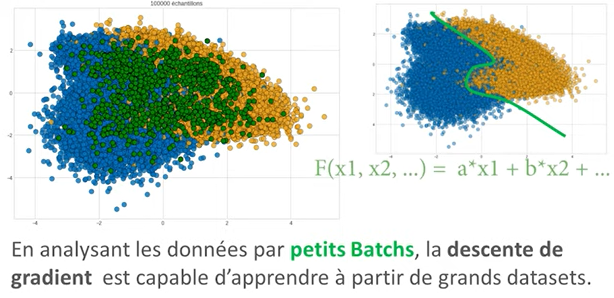

## NB
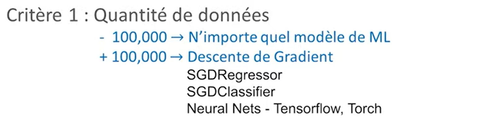

## Critère #2: Données Structurées / Non Structurées
Le deuxième critère de selection de modèle répose sur la structure des données.

## Données Non-Structurées

En effet en machine learning, on considère que les images, les textes, les sons, ... sont des données non-structurées.

Lorsqu'on a à faire avec les données non-structurées il est preferable d'utiliser les algorithmes de **Deep Learning** 

## Données Structurées

Alors que les données tabulaires

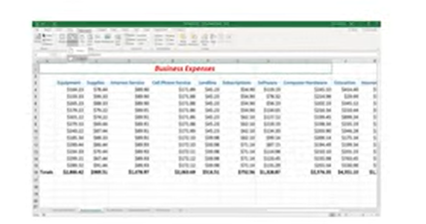

Lorsqu'on a à faire avec les données structurées il est preferable d'utiliser les algorithmes de **Machine Learning** 

## Critère #3: Normalité des données

Le troisième critère peut être axé sur la normalité des données pourquoi par ce qu'en **Machine Learning**, il y a deux types de modèles: (Paramétrique et Non-Paramétrique)

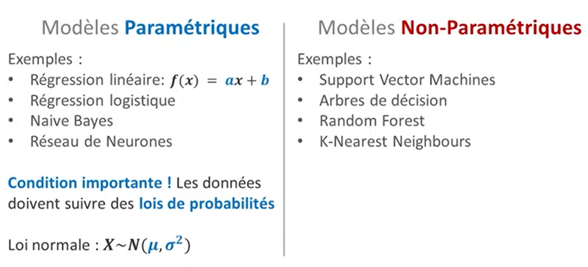

Pourquoi est-ce qu'important parce que les modèles paramétriques fonctionnnent très bien avec les données qui suivent les loi de la distribution normale pensez à utiliser les modèles paramétriques sinon dans tous les autre cas utilisez les modèles non-paramétriques ou il faut faire du preprocessing pour obtenir les données normées.

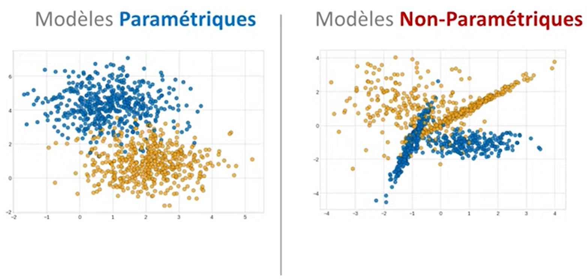

## Critère #4: Variables Quantitatives / Qualitatives

Un quatrième critère à prendre en compte est la quantité des varibles quantitatives et qualitatives dont vous disposez.

### Variables Quantitatives
Sachez qu'il existe certains types de modèles tel que: les arbres de decision et tout ce qui en decoule qui ne sont pas très efficace avec les données qui contiennent beaucoup de variables quantitatives et surtout lorsque vous observez des relations lineaires entre ces variable quantitatives.

Pour illustrer cela: 

* **Exemple 1:**
on a un dataset qui contient deux variable quantitatives qui ont des rélation parfaitement lineaire.

    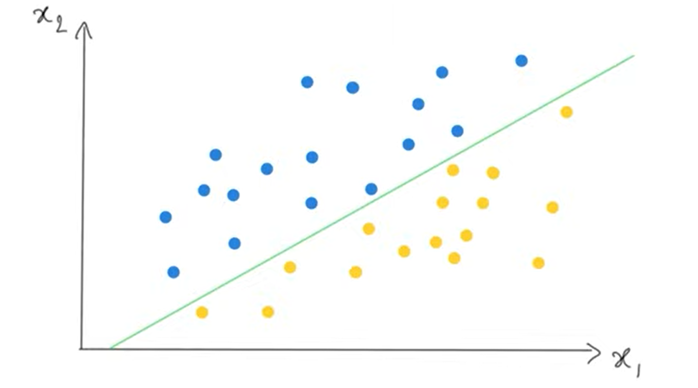
Seulement quand on utilise les arbres de décisions ils ne peuvent pas tracer ce genre de droite.

* A la place ils les decoupent les axes de notre plan de manière orthogonale de façon à former des escaliers et c'est justement ça le problème. Ces escaliers ont un fort risque d'avoir de l'**Over-fitting** pourquoi parce que si on ajoute plus de points dans nos données c'est à dire d'autre points venant du testset beaucoup seront mal classés à cause de la forme d'escalier.
    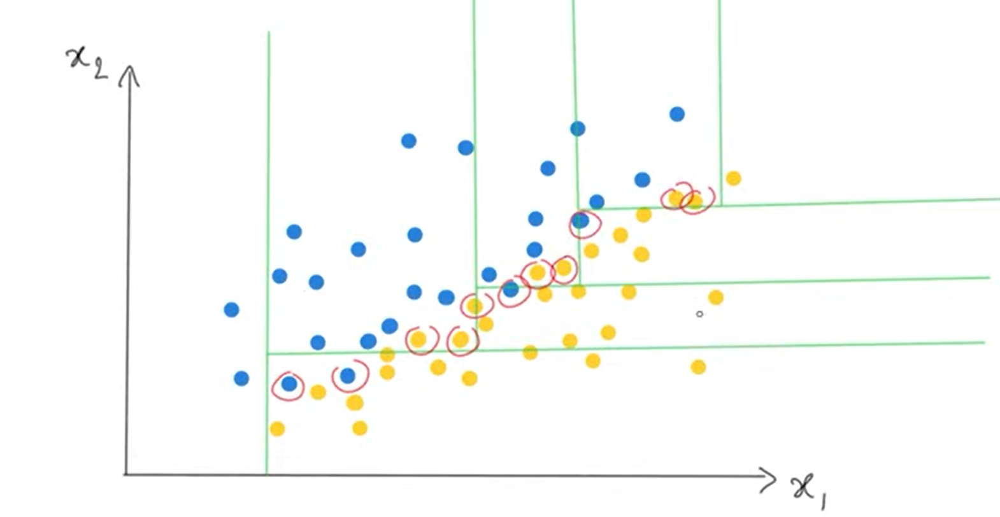
voilà pour quand on a beaucoup de variable quantitative avec des relation lineares on risque fort d'avoir de l'**Over-fitting**
